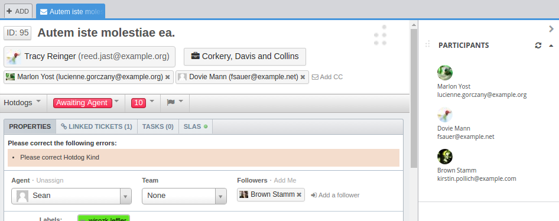

DeskPRO React SDK
=================

This tutorial will walk you through creating a simple DeskPRO app which displays a list of people participating in a ticket.



### Step 1. Clone the boilerplate

```
git clone https://github.com/deskpro/deskproapps-boilerplate-react participants
cd participants
npm install
```

### Step 2. Update the manifest
Update the "deskpro" property in the _package.json_, which you can find in your project root. Change the "title" property to "Participants".

```json
{
  "deskpro": {
    "version": "2.1.0",
    "title": "Participants",
    "isSingle": true,
    "scope": "agent",
    "targets": [
      {
        "target": "ticket-sidebar",
        "url": "html/index.html"
      }
    ]
  }
}
```

### Step 3. Modify the app component
Your app component can be found in the file _src/main/javascript/App.jsx_.

```jsx
import React from 'react';
import { Container, Avatar } from 'deskpro-components';

export default class App extends React.Component {
  render() {
    const { tabData } = this.props;
    
    return (
      <Container>
        <ul className="participants-list">
          {tabData.participants.map((p) => (
            <li key={p.person.id}>
              <Avatar src={p.person.default_picture_url} />
              <div>
                {p.person.name}
              </div>
              <div>
                {p.person.primary_email.email}
              </div>
            </li>
          ))}
        </ul>
      </Container>
    );
  }
}
```

### Step 4. Modify the app styles
The boilerplate includes a SASS stylesheet which can be found in _src/main/sass/index.scss_. Modify the stylesheet to look like the following.

```sass
$dp-styles-font-path: "~deskpro-components/src/styles/fonts/";
@import "~deskpro-components/src/styles/main.scss";

.participants-list {
  list-style-type: none;
  
  li {
    margin-bottom: 1rem;
  }
}
```

### Step 5. Run the dev server
Start the built in dev server.

```
npm run dev
```

Now open your browser to [https://deskpro-dev/agent/?appstore.environment=development](https://deskpro-dev/agent/?appstore.environment=development).

